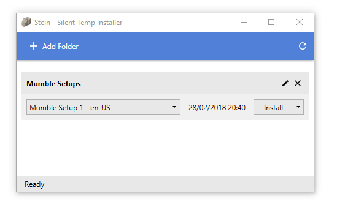

# Stein - Silent Temp Installer

This application makes it easier to install, uninstall or reinstall multiple MSI-installers. It can be used in an environment, where there are regular builds of an application which are located inside a defined folder structure.

**Please note:** This application need administrator privileges to operate on installers without UI.

## Supported folder structure

Installers are bundled by folder and by culture (ProductLanguage property on the MSI-file).
The supported folder structure is:

- selected folder
  - build01
    - installer1_enUS.msi
    - installer1_deDE.msi
    - installer2_enUS.msi
    - installer2_deDE.msi
  - build02
    - installer1_enUS.msi
    - installer1_deDE.msi
    - installer2_enUS.msi
    - installer2_deDE.msi
   
It will generate 4 installer bundles: 
- tmp01 - enUS 
  - tmp01/installer1_enUS.msi
  - tmp01/installer2_enUS.msi
- tmp01 - deDE
  - tmp01/installer1_deDE.msi
  - tmp01/installer2_deDE.msi
- tmp02 - enUS
  - tmp02/installer1_enUS.msi
  - tmp02/installer2_enUS.msi
- tmp02 - deDE
  - tmp02/installer1_deDE.msi
  - tmp02/installer2_deDE.msi

## Available options

### No UI during install

It will start installers with the "/QN" option which means it will be installed in the background with default options.
When this option is set, the Disable reboot after installation option should be strongly considered especially when operating with multiple installers at the same time.

### Disable reboot after installtion

It will start installers with the "/norestart" option which means the installer should not automatically after installation. 

### Install log

It will start installers with the "/L*V LOGPATH" option which means the installer should extensively log all operations.

## Contribution

If you find a bug feel free to open an issue. Contributions are also appreciated.

## Dependencies

This application depends on the following libraries:
- [MVVMBase](https://github.com/nkristek/MVVMBase)
- [Wpf.Converters](https://github.com/nkristek/Wpf.Converters)
- [GongSolutions.WPF.DragDrop](https://github.com/punker76/gong-wpf-dragdrop)
- [log4net](http://logging.apache.org/log4net/)
- [Windows-API-Code-Pack](https://github.com/aybe/Windows-API-Code-Pack-1.1)
- [Wix Toolset](http://wixtoolset.org/)

The icons used by this application come from [fontawesome](https://fontawesome.com) ([licence](https://fontawesome.com/license)) and are modified to be used in a WPF environment.
