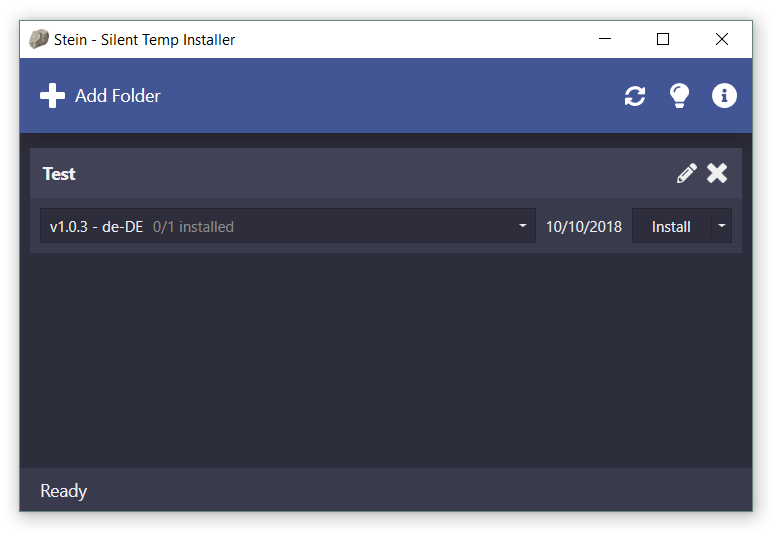

# Stein - Silent Temp Installer

This application makes it easier to install, uninstall or reinstall multiple MSI-installers. 
It was built for an environment with regular builds of an application.

**Please note:** This application needs administrator privileges to operate on installers without UI.

Support for dark mode

## Available options

### No UI during install

It will start installers with the "/QN" option which means it will be installed in the background with default options.
When this option is set, the [Disable reboot after installation](#disable-reboot-after-installation) option should be strongly considered especially when operating with multiple installers at once.

### Disable reboot after installation

It will start installers with the "/norestart" option which means the installer should not automatically reboot the system after installation. 

### Filter duplicate installers

If enabled, only one installer per application will be installed. This is usefull, when there are multiple installers which install the same application but different languages.

### Install log

It will start installers with the "/L*V LOGPATH" option which means the installer should log all operations.
You can optionally set a limit on how many log files should be kept. After an operation, the oldest log files will be deleted.

### Additional arguments

When performing a custom operation you can define additional arguments for each installer. 

## Contribution

If you find a bug feel free to open an issue. Contributions are also appreciated.

**Please note**: 
You have to have the [Wix Toolset](http://wixtoolset.org) installed in order to compile the [Stein.Services](../blob/master/Stein.Services) project. The version currently used to build this application is [3.11.1](http://wixtoolset.org/releases/v3.11.1/stable).

## Dependencies

This application depends on the following libraries:
- [Smaragd](https://github.com/nkristek/Smaragd)
- [Wpf.Converters](https://github.com/nkristek/Wpf.Converters)
- [AdonisUI](https://github.com/benruehl/adonis-ui)
- [GongSolutions.WPF.DragDrop](https://github.com/punker76/gong-wpf-dragdrop)
- [log4net](http://logging.apache.org/log4net/)
- [ninject](https://github.com/ninject/Ninject)
- [Windows-API-Code-Pack](https://github.com/aybe/Windows-API-Code-Pack-1.1)
- [Wix Toolset](http://wixtoolset.org/)

The icons used by this application are from [fontawesome](https://fontawesome.com) ([licence](https://fontawesome.com/license)) and are modified to be used in a WPF environment.
